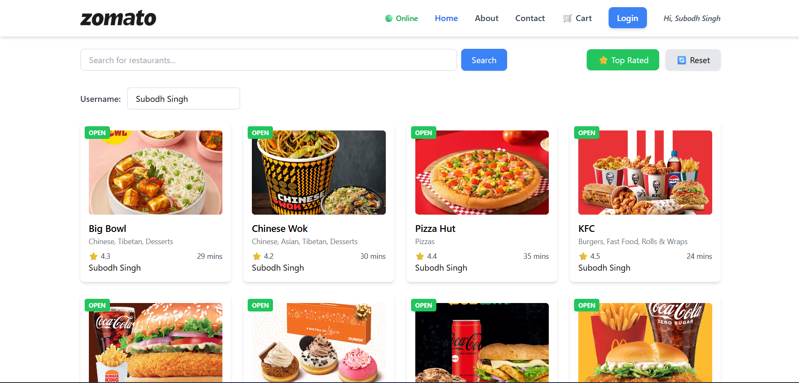
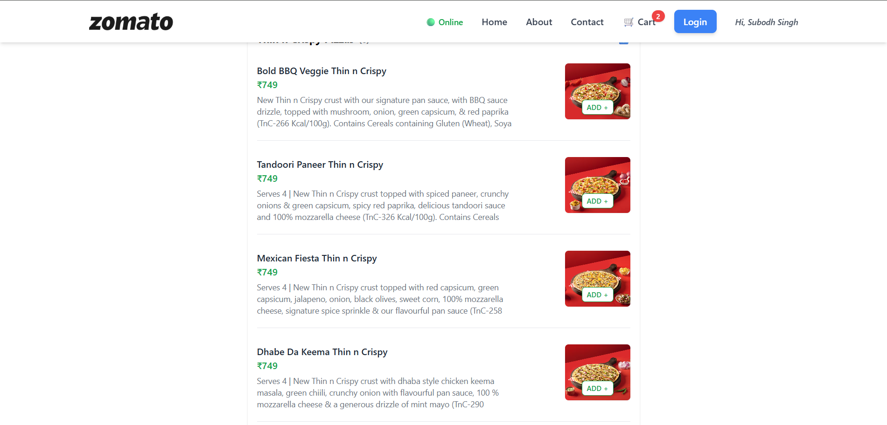
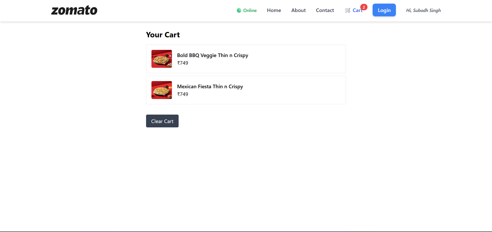

# 🍔 Swiggy Clone (React + Live API)

A learning project built with **React** while following the Namaste React course.  
This clone uses **Swiggy’s live API** to fetch real-time restaurant and menu data.

👉 **[Live Demo on Netlify](https://swiggy-clone-subodh.netlify.app/)**  
📂 **[GitHub Repository](https://github.com/subodh2708/swiggy-clone)**

---

## 🚀 Features

- 🔍 **Search Restaurants** by name
- ⭐ **Filter Top Rated Restaurants**
- 🛒 **Cart Functionality** (Add, Remove, Clear items using Redux Toolkit)
- 📋 **Restaurant Menu Accordion** (expand/collapse categories)
- 🌐 **Live API Integration** with Swiggy
- 📶 **Online/Offline Status Indicator**
- 👤 **Context API Demo** with Username update

---

## 🛠️ Tech Stack

- **React** (Functional Components, Hooks)
- **React Router** for navigation
- **Redux Toolkit** for cart management
- **Tailwind CSS** for styling
- **Jest + React Testing Library** for unit tests
- **Netlify** for deployment

---

## 📸 Screenshots

### Home Page

### Restaurant Menu

### Cart

---

## 🙌 Learning Journey

This project was built as part of my React learning journey.  
Instead of making a polished production clone, the focus was on **learning core React concepts**:

- Controlled vs uncontrolled components
- Higher-Order Components (HOC)
- Custom Hooks
- Context API
- Redux Toolkit
- Integration with real APIs
- Writing tests with Jest

---

## 🌐 Deployment

The project is deployed on **Netlify**.

- Build command: `npm run build`
- Publish directory: `dist` (for Parcel / Vite) or `build` (for CRA)

---

✌️ Made with React, Tailwind, and a lot of debugging.
